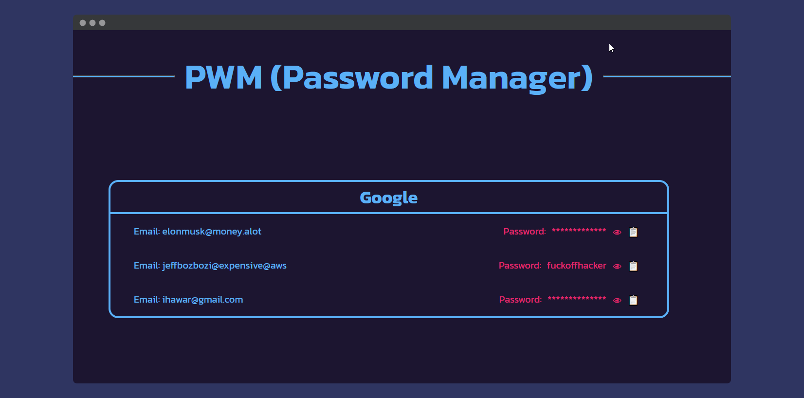

<div align="center">

# 🛡️ PWM — Terminal Password Manager


</div>

---

🎯 **PWM** is a simple and offline terminal-based password manager.  
No syncing. No servers. No bloat. Just your passwords stored safely on your machine.

> ✨ Built for developers, hackers, and keyboard warriors who love simplicity and privacy.

---

## 📸 Preview

<!-- Put your screenshot here -->


<!-- Put your gif here -->




---

## 🚀 Features

- 🧠 Simple CLI interface — no need to learn another tool
- 🔐 Everything is stored **locally** (no cloud)
- 💻 Instant Web View (`pwm web`)
- 📁 Export in `txt` or `json`
- 📦 Clean and extendable project layout

---

## ⚙️ Quick Start

```bash
> pwm -h

usage: PWM [-h] {app,all,view,export,web} ...

A terminal password manager.

positional arguments:
  {app,all,view,export,web}

options:
  -h, --help  show help message and exit
```

A few common commands:

```bash
pwm app create     # Create an app entry
pwm all            # View all stored apps
pwm view <app>     # View a single app
pwm export json    # Export everything to JSON
pwm web            # Launch web viewer in browser
```

## 📦 Installation

```bash
pip install pwm
```

or

```bash
git clone https://github.com/ihawar/pwm-project.git
cd pwm-project
pip install .
```

<div align="center">

Built with 💜 by hawar

</div>
